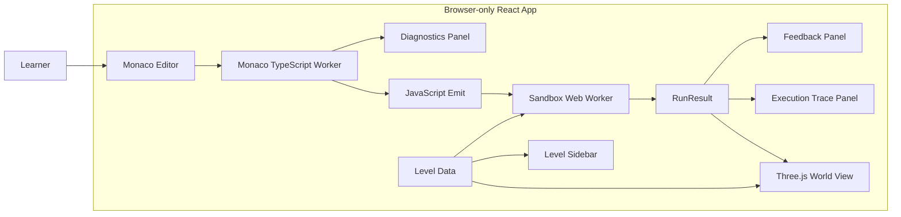
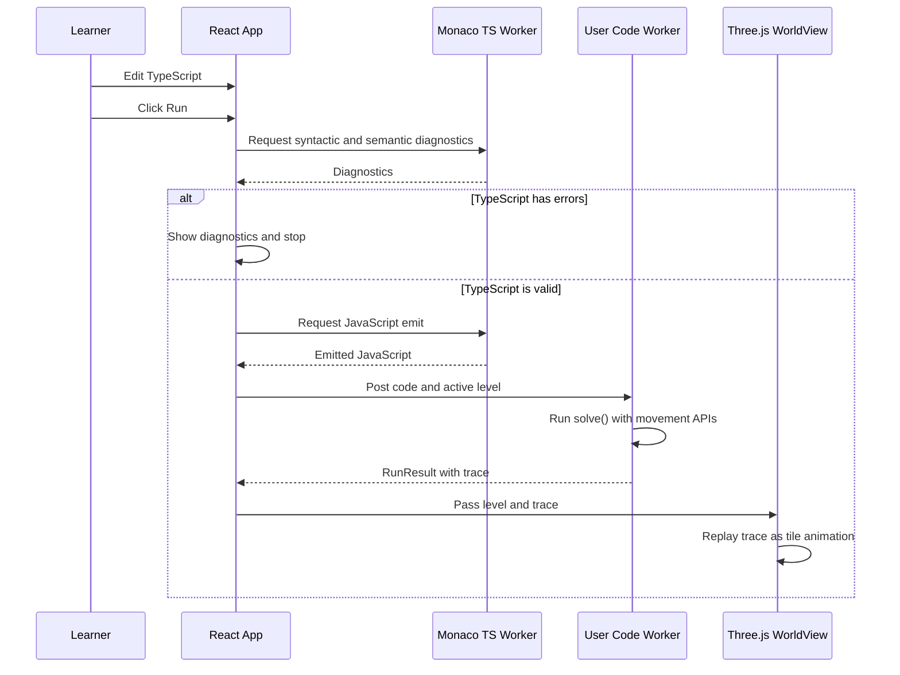
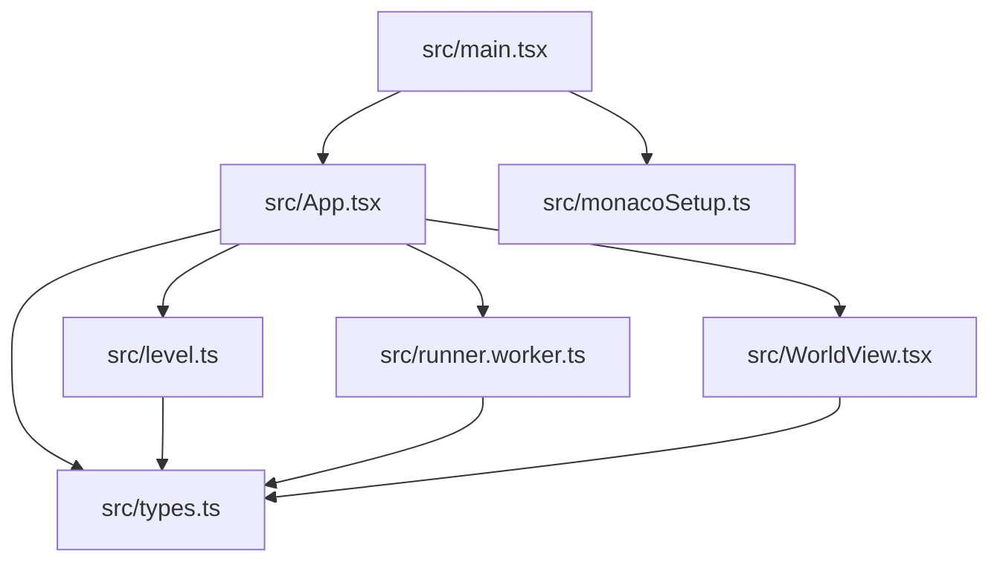

# Architecture Overview

This app is a fully client-side TypeScript learning minigame. There is no backend and no server-side compilation. The browser owns editing, type-checking, transpilation, user-code execution, game feedback, and world rendering.

## High-Level System

## Runtime Flow

## Main Modules

## Responsibilities

`src/App.tsx` coordinates the UI. It owns the selected level, editor value, diagnostics, run status, and worker invocation.

`src/level.ts` defines level data and the TypeScript declarations that Monaco uses to understand the game API.

`src/runner.worker.ts` runs emitted JavaScript in a Web Worker and returns deterministic game results.

`src/WorldView.tsx` renders the tiny field with Three.js and animates the trace.

`src/monacoSetup.ts` configures Monaco's editor and TypeScript workers for Vite.

`src/types.ts` keeps shared contracts small and explicit.

